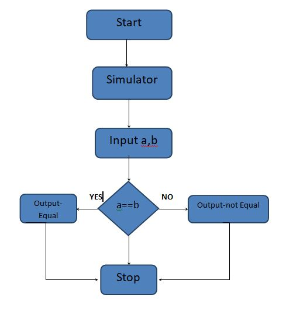
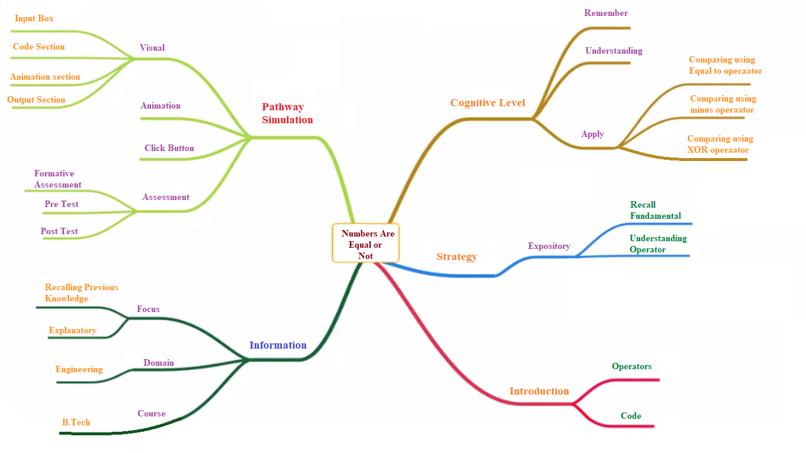
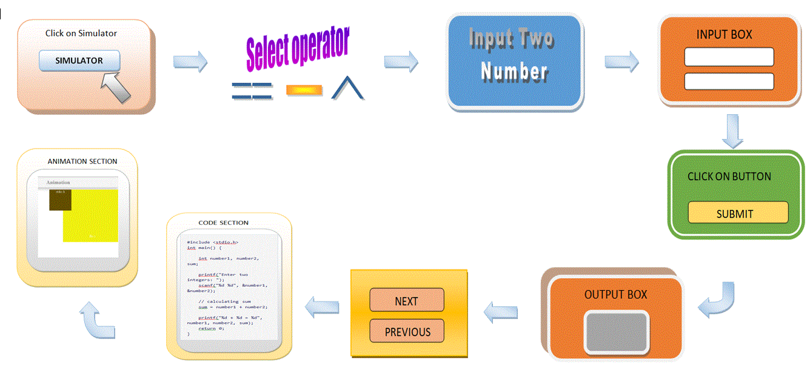

## Storyboard (Round 2)

<b>Experiment: WAP that checks whether the two numbers entered by the user are equal or not.</b>

### 1. Story Outline:

User will be provided three operators to choose on simulator screen on the basics of that next phase will appear which will be divided in to three parts the first part contain input and output boxes in which user can provide the input to the simulator after giving input user have to click on submit button to get the output .When output is displayed two button shows up i.e. next and previous which is used for traversing over the code in the code section and the next part is code section in this section the code will be generated automatically according to input provided by the user. And in the last there is an Animation section in the section user will be able to see over all working of the code visually.    

### 2. Story:

In this simulator we have used 3 operators to check two numbers are equal or not. User will choose any one of them
These 3 operators are -:
 1. Equal to operator (==)
 2. Minus operator (-)
 3. XOR operator (^)
 When user will choose any operator of these three  then choosing simulator will render where user can input the number in the input box  then user will  press click button if numbers are equal then it will show equal in the output section and code of the program will show in code section where we can see the code execution. 
We will use next or previous button to see the code execution of each and every line when user will click NEXT OR PREVIOUS button then user can also see animation in the animation section to visualize the every line of code execution by the animation.

#### 2.1 Set the Visual Stage Description:
 I.	The simulator screen, divided into three parts, for selecting operators equal to, minus and XOR.
 II.	After selecting operator simulator screen is subdivided into three sections for input, code and Animation. 
 III.	First section contains input and output text box.
 IV.	 SUBMIT button is provided below the input box.
 V.	NEXT and PREVIOUS button is provided below output box.
 VI.	Next section is code section which shows the code according to input provided. 
 VII.	In last there is Animation section which shows working of code.

#### 2.2 Set User Objectives & Goals:
I.	By this experiment user will be able to understand and describe the basic concept of C programming.
 II.	User will be able to understand the procedure of writing code.
 III.	User will be able to understand the working of operator.
IV.	User will be able to find out that numbers are equal or not.

#### 2.3 Set the Pathway Activities:

I. When the user will click on the simulator, simulator screen will be open up. The user will see three options on screen.  
 II.	When the user will click on any option, simulator screen will divided into three sections.
 III. On screen firstly there is an input section where user can provide the input and click on check button to get the result.
 IV.	 After that there is a code section where user can get an idea about the code and concept of C programming.
 V.	 At the last there is an animation section which will simulate the code.

##### 2.4 Set Challenges and Questions/Complexity/Variations in Questions:

I.	To find whether the number entered by the user are equal or not?

##### 2.5 Allow pitfalls:
I.	User should not enter string in the input box.
 II.	Float value is not accepted. 

##### 2.6 Conclusion:
I.	User will take hardly 5 minutes to understand the procedure.
 II.	It will take max. 10 minutes to complete the experiment.
 III.	User will get a basic idea and procedure to make a program.

##### 2.7 Equations/formulas:
I.	Equal to operator:

To check whether the number is equal or not :
 I.	Input two numbers A and B.
 II.	Use equal to operator (==) to check.
 III.	Example:- A==B (A=5 and B=5)
 IV.	5==5
 V.	Result: A and B are equal.
 
 II.	Minus operator:
 To check whether the number is equal or not :
 I.	Input two numbers A and B.
 II.	Use minus operator (-) to check.
 III.	Example:- A-B (A=10 and B=5)
 IV.	10-5=5 (A-B=0 to be equal)
 V.	Result: A and B are not equal.

### 3. Flowchart 

### 4. Mindmap:

 

### 5. Storyboard :

