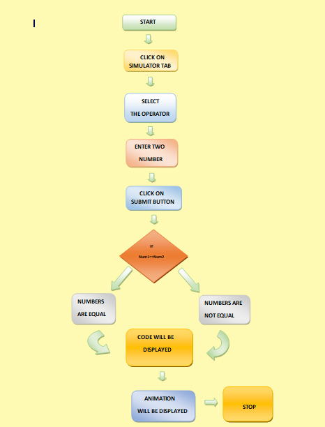

## Storyboard (Round 2)

<b>Experiment: WAP that checks whether the two numbers entered by the user are equal or not.</b>

### 1. Story Outline:

C is a general-purpose programming language that is extremely popular, simple and flexible. It is machine-independent, structured programming language which is used extensively in various applications. 
In this experiment a user wants to check whether the two numbers entered by the user are equal or not. The objective of this experiment is that a user can understand and describe basic concept of C programming using this experiment. 

### 2. Story:

I.	Firstly user will get the basic knowledge of C Programming and by seeing the code; they can get an idea about the experiment
 II.	There are various keywords, functions and header files used, so user can also understand the basic tags.  
III.	User can get an idea about the structure of C Programming.

#### 2.1 Set the Visual Stage Description:
I.	The simulator screen, divided into three parts, for selecting operators which is subdivided into three sections for input code and Animation. User can see the code of experiment and basic description of the code.
 II.	There are text boxes for input (Numbers). 
III.	There is a buttons namely check by which a user can get their result

#### 2.2 Set User Objectives & Goals:
I.	By this experiment user will be able to understand and describe the basic concept of C programming.
 II.	User will be able to understand the procedure of writing code.
 III.	User will be able to understand the working of operator.
IV.	User will be able to find out that numbers are equal or not.

#### 2.3 Set the Pathway Activities:

I.	When the user will click on the simulator, simulator screen will be open up. The user will see three options on screen. 
II.	When the user will click on any option, simulator screen will be open up. Then screen is divided into three parts.
III.	On screen firstly there is an input section where user can provide the input and click on check button to get the result.
IV.	 After that there is a code section where user can get an idea about the code and concept of C programming.
V.	 At the last there is an animation section which will simulate the code.

##### 2.4 Set Challenges and Questions/Complexity/Variations in Questions:

I.	What do you mean by header files? What are uses of header file?
II.	What are the function of operator?
III.	What do you understand by operator?
IV.	How many types of operators are present in c language?
V.	What do you understand by bit wise operator?
VI.	Can we run a program with using header files? Explain.
VII.	Define function and its type. How many functions are used in this code?
VIII.	What will happen if we are not using getch() function?

##### 2.5 Allow pitfalls:
I.	If user is not familiar with any programming language.
II.	If the user is not familiar with operator of the language.

##### 2.6 Conclusion:
I.	User will take hardly 5 minutes to understand the procedure.
II.	It will take max. 10 minutes to complete the experiment.
III.	User will get a basic idea and procedure to make a program.

##### 2.7 Equations/formulas: NA
I.	Equal to operator:

To check whether the number is equal or not :
I.	Input two numbers A and B.
II.	Use equal to operator (==) to check.
III.	Example:- A==B (A=5 and B=5)
IV.	5==5
V.	Result: A and B are equal.
 
 II.	Minus operator:
To check whether the number is equal or not :
I.	Input two numbers A and B.
II.	Use minus operator (-) to check.
III.	Example:- A-B (A=10 and B=5)
IV.	10-5=5 (A-B=0 to be equal)
V.	Result: A and B are not equal.

### 3. Flowchart 4

### 4. Mindmap:

 Link to mindmap here : Store the mindmap in both .mm & .png extension in the  /mindmap folder and include link of only .pdf verison here
  
 (guide : An elaborate mind map (connecting all the points in the experiment flow ) should be prepared and submitted by the lab proposer. The mind map should be a clear and detailed document that takes into account all minute intri5acies involved in the development of virtual lab. The mindmap should be self-content and any developer across the globe should be able to code it with all those details. using only FreeMind http://freemind.sourceforge.net/wiki/index.php/Main_Page (send the .png file and also the original .mm extension project file. )

### 5. Storyboard :
Storyboard: <a href="Storyboard/carwiper.gif"> [here]</a>
Link to storybaord (.gif file ) here :
(guide: This document should include sketching and description scene wise (duration, action, description). Software to be used for storyboarding : https://wonderunit.com/storyboarder/ (Its a FOSS tool) . tutorial on how to use it https://www.youtube.com/watch?v=LAeCEpG0KX4
